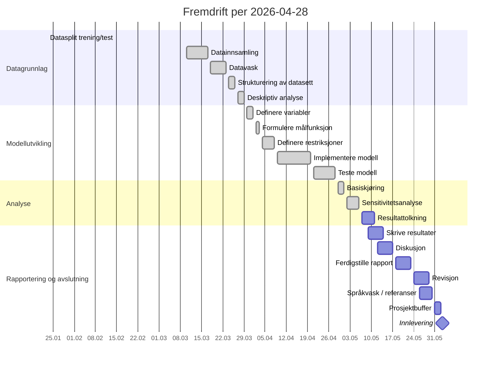

# Status - Minimering av drivstoffkostnader hos Odfjell Tankers

_Sist oppdatert: 2026-04-28 22:45_

Denne filen er generert fra:
- `012 fase 2 - plan/Prosjektstyringsplan, Odfjell Tankers.md`
- `012 fase 2 - plan/MS_Project.mpp`
- faktiske filer og siste aktivitet i repoet

## Innholdsfortegnelse

- [Statusdashboard](#statusdashboard)
- [Neste steg](#neste-steg)
- [Gantt og milepæler](#gantt-og-milepæler)
- [Aktivitetsstatus](#aktivitetsstatus)
- [Aktivitetssjekklister](#aktivitetssjekklister)
- [Spor i repoet](#spor-i-repoet)
- [Manuelle merknader](#manuelle-merknader)

## Statusdashboard

| Felt | Status |
| --- | --- |
| Fase nå | Analyse |
| Aktivitet nå | `Sensitivitetsanalyse` er gjennomført i repo; `Resultattolkning` er neste aktivitet |
| Planperiode nå | 2026-05-07 til 2026-05-11 |
| Neste aktivitet | `Resultattolkning` |
| Neste milepæl | `Innlevering` 2026-06-02 |
| Fullførte aktiviteter | 12 av 19 viste planaktiviteter i MPP, uten prosjektbuffer |
| Aktiviteter pågår | 0 |
| Aktiviteter kommende | 7 |
| Aktiviteter med statusavvik | 0 |
| Fremdriftsvurdering | `Definere restriksjoner`, `implementere modell`, `Teste modell`, `Basiskjøring` og `Sensitivitetsanalyse` er faglig gjennomført og samsvarer nå bedre med gjeldende `MS_Project.mpp`. Nye voyage-data er strukturert, pseudonymisert og kvalitetssjekket, men er fortsatt operasjonell støtte og ikke primær modellinput for modellen |

- Planunderlaget er dokumentert i både prosjektstyringsplanen og `MS_Project.mpp`.
- Repoet inneholder rådata i `004 data`, renset pris-/volumdatasett i `006 analysis/01_datagrunnlag`, foreløpig strukturert og kvalitetssjekket voyage-data, samt modellinput og modellimplementasjon i `006 analysis/02_modellutvikling`.
- Deskriptive figurer og tabeller er nå dokumentert i `006 analysis/01_datagrunnlag/04_deskriptiv_analyse` og brukt i `005 report/rapport.md`.
- Supplerende 2025-data for åtte anonymiserte fartøyfiler er mottatt i `004 data` og dokumentert i `006 analysis/01_datagrunnlag/01_datainnsamling/tilleggsdata_2025.md`.
- `Datasplit trening/test` ligger nå som egen fullført aktivitet i `MS_Project.mpp` med dato 2026-01-23.
- Gjeldende `MS_Project.mpp` viser nå 100 % fullført for `Definere restriksjoner` og `implementere modell`, og tidligere statusavvik er lukket.

[Til toppen](#innholdsfortegnelse)

## Neste steg

### Nå

- [x] Opprinnelig pris-/volumdatagrunnlag er renset, strukturert og dokumentert for modellen
- [x] Modellinput for versjon 1 er etablert
- [x] Første modellimplementasjon finnes i `006 analysis/02_modellutvikling/04_implementere_modell`
- [x] Simulert modelltest er kjørt på nytt 2026-04-28 og outputfiler finnes i `006 analysis/02_modellutvikling/05_teste_modell/output`
- [x] Testnotat er skrevet i `006 analysis/02_modellutvikling/05_teste_modell/README.md`
- [x] Simulert resultat-CSV er korrigert slik at valgt pris og beregnet kostnad vises per måned og havn
- [x] Endelig valideringsgrunnlag for modellen er valgt: solver-uavhengig simulering
- [x] Basiskjøring for modellen er gjennomført med opprinnelig pris-/volumdata som primær modellinput
- [x] Sensitivitetsanalyse for modellen er gjennomført med 19 scenarioer for pris og etterspørsel
- [x] Tilleggsdata fra 2025 er dokumentert med fartøyklasser, tankkapasitet, voyage-koder, ROB-felt og kontraktskontekst
- [x] Tilleggsdata fra 2025 er foreløpig strukturert til hendelses-, etappe- og kapasitetstabeller
- [x] Voyage-råfilene fra 2025 er splittet kronologisk 80/20 før videre rensing
- [x] Voyage-havner og voyage-numre fra 2025 er pseudonymisert på plass med P- og VG-koder
- [x] Voyage-data fra 2025 er kvalitetssjekket med egen avviksrapport
- [x] Voyage-data brukes som kvantitativ operasjonell støtte i rapporten, ikke som direkte modellinput i modellen
- [x] Ny faglitteratur om operasjonsledelse er lagt til i `003 references` og bibliografien i `005 report/rapport.md`
- [x] Referansenotatene for Stopford og Grammenos er kortet ned og standardisert med samme struktur som øvrige boknotater
- [x] Nye referansenotater for Fox og Burks samt Song og Panayides er lagt til i `003 references`
- [x] Kravregisteret er oppdatert slik at modellen avgrenses til de fire modellhavnene P001-P004, siden prosjektet ikke forventer nok data til å modellere de 10 mest brukte havnene innen fristen
- [x] MPP-prosentene for `Definere restriksjoner` og `implementere modell` er oppdatert manuelt til 100 % fullført
- [x] Avklar om endelig testgrunnlag skal være Pyomo med faktisk solver eller solver-uavhengig simulering

### For å lukke neste aktivitet

Aktiviteten `Teste modell` kan lukkes faglig.

For å markere `Teste modell` som fullført bør dere minst ha:
- [x] en kort testbeskrivelse av hva som er kjørt
- [x] en vurdering av om modellen oppfører seg konsistent med forventet logikk
- [x] en eksplisitt henvisning til resultatfilene i `006 analysis/02_modellutvikling/05_teste_modell/output`
- [x] en kort konklusjon om at modellen kan tas videre til `Basiskjøring`
- [x] en endelig beslutning om solver-kjøring eller simulering som valideringsgrunnlag

### Etterpå

- `Resultattolkning` kan starte med basiskjøring og sensitivitetsanalyse som resultatgrunnlag.
- Etter `Resultattolkning` følger rapportering av resultater og diskusjon.

[Til toppen](#innholdsfortegnelse)

## Gantt og milepæler

### Milepæler

Neste kommende milepæl er **Innlevering** den **2026-06-02**. Milepælen **Modelltesting ferdig** den **2026-04-28** er faglig oppnådd i repoet.

| Milepæl | Dato | Status | Kommentar |
| --- | --- | --- | --- |
| Proposal godkjent | 2026-02-08 | Passert | Fullført tidligere i prosjektet |
| Planleggingsfase ferdig | 2026-03-09 | Passert | Fullført tidligere i prosjektet |
| Datagrunnlag ferdig | 2026-03-29 | Passert | Datagrunnlaget er dokumentert og brukt videre |
| Modelltesting ferdig | 2026-04-28 | Fullført i repo | Solver-uavhengig simulering er valgt som endelig valideringsgrunnlag for modellen |
| Innlevering | 2026-06-02 | Kommende | Styrende sluttdato fra `MS_Project.mpp` |

### Gantt-oversikt

#### ASCII-visning

Forklaring:
- `██` = fullført
- `▓▓` = pågår
- `··` = kommende

| Fase | Aktivitet | Periode | Status | Tidslinje |
| --- | --- | --- | --- | --- |
| Datagrunnlag | Datasplit trening/test | 2026-01-23 | Fullført | `██` |
| Datagrunnlag | Datainnsamling | 2026-03-10–2026-03-17 | Fullført | `██` |
| Datagrunnlag | Datavask | 2026-03-18–2026-03-23 | Fullført | `██` |
| Datagrunnlag | Strukturering av datasett | 2026-03-24–2026-03-26 | Fullført | `██` |
| Datagrunnlag | Rense og validere voyage-data 2025 | 2026-04-28 | Fullført støtteaktivitet | `██` |
| Datagrunnlag | Deskriptiv analyse | 2026-03-27–2026-03-29 | Fullført | `██` |
| Modellutvikling | Definere variabler | 2026-03-30–2026-04-01 | Fullført | `██` |
| Modellutvikling | Formulere målfunksjon | 2026-04-02–2026-04-03 | Fullført | `██` |
| Modellutvikling | Definere restriksjoner | 2026-04-04–2026-04-08 | Fullført | `██` |
| Modellutvikling | Implementere modell | 2026-04-09–2026-04-20 | Fullført | `██` |
| Modellutvikling | Teste modell | 2026-04-21–2026-04-28 | Fullført i repo | `██` |
| Analyse | Basiskjøring | 2026-04-29–2026-05-01 | Fullført i repo | `██` |
| Analyse | Sensitivitetsanalyse | 2026-05-02–2026-05-06 | Fullført i repo | `██` |
| Analyse | Resultattolkning | 2026-05-07–2026-05-11 | Kommende | `··` |
| Rapportering | Skrive resultater | 2026-05-09–2026-05-14 | Kommende | `··` |
| Rapportering | Diskusjon | 2026-05-12–2026-05-17 | Kommende | `··` |
| Rapportering | Ferdigstille rapport | 2026-05-18–2026-05-23 | Kommende | `··` |
| Rapportering | Revisjon | 2026-05-24–2026-05-29 | Kommende | `··` |
| Rapportering | Språkvask / referanser | 2026-05-26–2026-05-30 | Kommende | `··` |
| Avslutning | Innlevering | 2026-06-02 | Kommende | `··` |

#### Mermaid-visning

[Til toppen](#innholdsfortegnelse)

## Aktivitetsstatus

| Fase | Aktivitet | Start | Slutt | Status 2026-04-28 | Neste handling / grunnlag |
| --- | --- | --- | --- | --- | --- |
| Datagrunnlag | Datasplit trening/test | 2026-01-23 | 2026-01-23 | Fullført | Ny MPP-aktivitet med 100 % fullført; repoet har train/test-filer i `004 data` |
| Datagrunnlag | Datainnsamling | 2026-03-10 | 2026-03-17 | Fullført | Dokumentert i repo |
| Datagrunnlag | Datavask | 2026-03-18 | 2026-03-23 | Fullført | Dokumentert i `006 analysis/01_datagrunnlag/02_datavask` med rensepipeline og renset fil |
| Datagrunnlag | Strukturering av datasett | 2026-03-24 | 2026-03-26 | Fullført | Dokumentert i `006 analysis/01_datagrunnlag/03_strukturering_av_datasett` med aggregert datasett og metadata |
| Datagrunnlag | Rense og validere voyage-data 2025 | 2026-04-28 | 2026-04-28 | Fullført støtteaktivitet | Voyage-data er validert med egen kvalitetsrapport og avviksfil, og brukes som kvantitativ operasjonell støtte heller enn primær modellinput i modellen |
| Datagrunnlag | Deskriptiv analyse | 2026-03-27 | 2026-03-29 | Fullført | Dokumentert i `006 analysis/01_datagrunnlag/04_deskriptiv_analyse` med figurer, figurguide og bruk i `rapport.md` |
| Modellutvikling | Definere variabler | 2026-03-30 | 2026-04-01 | Fullført | Dokumentert i modellkapitlet i `005 report/rapport.md` og støttet av modellinput |
| Modellutvikling | Formulere målfunksjon | 2026-04-02 | 2026-04-03 | Fullført | Dokumentert i `005 report/rapport.md` og reflektert i modellskriptene |
| Modellutvikling | Definere restriksjoner | 2026-04-04 | 2026-04-08 | Fullført | MPP viser 100 %, og restriksjonsstruktur er dokumentert i `rapport.md` og reflektert i `run_model_v1_pyomo.py` |
| Modellutvikling | Implementere modell | 2026-04-09 | 2026-04-20 | Fullført | MPP viser 100 %, og modellinput, Pyomo-implementasjon og aktivitetsstruktur er etablert i `006 analysis/02_modellutvikling/04_implementere_modell` |
| Modellutvikling | Teste modell | 2026-04-21 | 2026-04-28 | Fullført | MPP viser 100 %, og solver-uavhengig simulering er valgt som endelig valideringsgrunnlag; testnotat og outputfiler foreligger |
| Analyse | Basiskjøring | 2026-04-29 | 2026-05-01 | Fullført i repo | Basiskjøring er gjennomført med modellen og dokumentert i `006 analysis/03_analyse/01_basiskjoring` |
| Analyse | Sensitivitetsanalyse | 2026-05-02 | 2026-05-06 | Fullført i repo | 19 scenarioer er kjørt og dokumentert i `006 analysis/03_analyse/02_sensitivitetsanalyse` |
| Analyse | Resultattolkning | 2026-05-07 | 2026-05-11 | Kommende | Avhenger av `Sensitivitetsanalyse` |
| Rapportering | Skrive resultater | 2026-05-09 | 2026-05-14 | Kommende | Starter etter første resultatgrunnlag |
| Rapportering | Diskusjon | 2026-05-12 | 2026-05-17 | Kommende | Avhenger av `Skrive resultater` |
| Rapportering | Ferdigstille rapport | 2026-05-18 | 2026-05-23 | Kommende | Avhenger av `Diskusjon` |
| Rapportering | Revisjon | 2026-05-24 | 2026-05-29 | Kommende | Avhenger av `Ferdigstille rapport` |
| Rapportering | Språkvask / referanser | 2026-05-26 | 2026-05-30 | Kommende | Avhenger av `Revisjon` |
| Avslutning | Prosjektbuffer | 2026-05-31 | 2026-06-02 | Kommende | Reservert buffer før innlevering |
| Avslutning | Innlevering | 2026-06-02 | 2026-06-02 | Kommende | Endelig milepæl |

[Til toppen](#innholdsfortegnelse)

## Aktivitetssjekklister

### Rense og strukturere data

Status: **Fullført**

#### Fullførte aktiviteter

- [x] Rådatafilen er identifisert og brukes konsekvent som kilde: `004 data/Bunker Lifting List(Worksheet1) (1).csv`
- [x] Rensepipeline er etablert i `006 analysis/01_datagrunnlag/02_datavask/src/clean_and_aggregate_bunker_data.py`
- [x] Renselogikken leser inn transaksjonsrader og filtrerer bort tomme eller ugyldige rader
- [x] Datoer og tallfelt parses eksplisitt i rensepipen
- [x] `Invoiced Qty` brukes som hovedvolum med fallback til `Ordered Qty`
- [x] `Invoice Price` brukes som hovedpris med fallback til `Order Price`
- [x] Observasjoner med manglende pris eller volum etter fallback håndteres eksplisitt i rensepipen
- [x] Observasjoner med ikke-positivt volum forkastes eksplisitt i rensepipen
- [x] Observasjoner med ikke-positiv pris forkastes eksplisitt i rensepipen
- [x] Rensede variabler som `delivery_month`, `delivery_year`, `effective_qty`, `effective_price` og `cost_value` opprettes
- [x] Renset transaksjonsfil er generert: `006 analysis/01_datagrunnlag/02_datavask/output/tab_bunker_cleaned.csv`
- [x] Aggregert datasett per `måned × havn` er generert: `006 analysis/01_datagrunnlag/03_strukturering_av_datasett/data/tab_bunker_monthly_by_port.csv`
- [x] Aggregatet inneholder sentrale strukturvariabler som transaksjonsantall, total mengde, vektet snittpris, enkelt snitt, minimum, maksimum og antall unike fartøy og leverandører
- [x] Oppsummeringsfil med nøkkeltall og renseutfall er generert: `006 analysis/01_datagrunnlag/03_strukturering_av_datasett/metadata/tab_bunker_summary.md`
- [x] Det aggregerte datasettet brukes videre som kilde til modellinput i `006 analysis/02_modellutvikling/04_implementere_modell/src/generate_model_v1_inputs.py`
- [x] Modellinput er generert videre til pris-, behovs- og tilgjengelighetsfiler i `006 analysis/02_modellutvikling/04_implementere_modell/input`

#### Kontrollpunkter som er oppfylt

- [x] Filene i aktivitetsmappene under `006 analysis/01_datagrunnlag` finnes og samsvarer med rense- og aggregeringsløpet
- [x] Kolonnenavnene i renset fil og aggregert fil er konsistente med videre bruk i modellinput
- [x] Antall observasjoner etter rensing er dokumentert i oppsummeringsfilen
- [x] Antall forkastede observasjoner er dokumentert i oppsummeringsfilen
- [x] Tidsperioden i aggregatet er dokumentert og brukt videre i modellinput
- [x] Havnene i aggregatet stemmer med havnene som brukes i modellen
- [x] Datastrukturen er tilstrekkelig moden til å støtte arbeidet med `Definere variabler`, `Formulere målfunksjon` og `Implementere modell`
- [x] Siste kontroll 2026-04-28 bekreftet at renset transaksjonsfil, månedsaggregat og train/test-splitt samsvarer med rense- og strukturlogikken

#### Verifisert opprydding før lukking av aktiviteten

- [x] `006 analysis/01_datagrunnlag/03_strukturering_av_datasett/metadata/tab_bunker_summary.md` er kontrollert direkte som UTF-8 og viser korrekt norsk tekst
- [x] `006 analysis/02_modellutvikling/04_implementere_modell/README.md` er kontrollert direkte som UTF-8 og viser korrekt norsk tekst
- [x] Statusgrunnlaget i denne filen er oppdatert slik at `Datavask` og `Strukturering av datasett` står som fullført
- [x] Det er lagt inn en kort metodebeskrivelse i rapportens kapittel `5 Metode og data` som forklarer rense- og aggregeringsløpet

#### Vurdering

- [x] Datavask er gjennomført og dokumentert
- [x] Strukturering av datasett er gjennomført og dokumentert
- [x] Aktiviteten `Rense og strukturere data` kan lukkes faglig i prosjektplanen

### Teste modell

Status: **Fullført i repo**

#### Ferdig så langt

- [x] Modellinput for versjon 1 finnes i `006 analysis/02_modellutvikling/04_implementere_modell/input`
- [x] Første Pyomo-implementasjon finnes i `006 analysis/02_modellutvikling/04_implementere_modell/src/run_model_v1_pyomo.py`
- [x] Simulert testskript finnes i `006 analysis/02_modellutvikling/05_teste_modell/src/simulate_model_v1_results.py`
- [x] Testoutput er opprettet i `006 analysis/02_modellutvikling/05_teste_modell/output`
- [x] Simulert modellsammendrag er generert i `res_model_v1_summary.json`
- [x] Testnotat er skrevet i `006 analysis/02_modellutvikling/05_teste_modell/README.md`
- [x] `res_model_v1_solution_by_port_month.csv` viser nå valgt pris og beregnet kostnad for valgte havner
- [x] Testen er kjørt på nytt 2026-04-28 med 61 månedsløsninger og total beregnet kostnad 473 953 291,65
- [x] Solver-uavhengig simulering er valgt som endelig valideringsgrunnlag for modellen

#### Må gjøres før aktiviteten kan lukkes

- [x] Skriv et kort testnotat som beskriver hva som er kjørt
- [x] Beskriv om testgrunnlaget er solver-kjøring, simulert test eller begge deler
- [x] Vurder om modellen oppfører seg konsistent med forventet logikk
- [x] Henvis eksplisitt til resultatfilene i `006 analysis/02_modellutvikling/05_teste_modell/output`
- [x] Konkluder kort med om modellen kan tas videre til `Basiskjøring`
- [x] Avklar om endelig validering skal bygge på Pyomo med faktisk solver eller på solver-uavhengig simulering

### Datasplit trening/test

Status: **Fullført**

#### Fullførte aktiviteter

- [x] Aktiviteten ligger nå som egen MPP-aktivitet med dato 2026-01-23 og 100 % fullført
- [x] Rådatasettet er sortert etter `Delivery Date` for å sikre kronologisk splitt
- [x] De tidligste 80 % av observasjonene er lagt i treningsfil
- [x] De siste 20 % av observasjonene er lagt i testfil
- [x] Originalfilen `004 data/Bunker Lifting List(Worksheet1) (1).csv` er beholdt uendret
- [x] Treningsfil er opprettet: `004 data/Bunker Lifting List(Worksheet1) (1)_train_80.csv`
- [x] Testfil er opprettet: `004 data/Bunker Lifting List(Worksheet1) (1)_test_20.csv`

#### Vurdering

- [x] Datasplitt trening/test er gjennomført og dokumentert
- [x] Steget behandles som fullført aktivitet i datagrunnlaget i `schedule.json`, `wbs.json`, `requirements.json` og `status.md`

### Rense og validere voyage-data 2025

Status: **Fullført støtteaktivitet**

#### Fullførte aktiviteter

- [x] Voyage-råfiler fra 2025 er strukturert til hendelses- og etappetabeller
- [x] Voyage-råfiler og strukturerte tabeller er pseudonymisert med P- og VG-koder
- [x] Datakvalitet er kontrollert med `006 analysis/01_datagrunnlag/03_strukturering_av_datasett/src/validate_voyage_data_quality_2025.py`
- [x] Avviksrapport er opprettet: `006 analysis/01_datagrunnlag/03_strukturering_av_datasett/metadata/tab_voyage_data_quality_2025.md`
- [x] Detaljert avviksfil er opprettet: `006 analysis/01_datagrunnlag/03_strukturering_av_datasett/data/tab_voyage_data_quality_issues_2025.csv`

#### Vurdering

- [x] Kontrollen dekker manglende ROB, null/negativt forbruk, tidsrekkefølge, tankkapasitet og modellrelevante koblingsfelt
- [x] Det er identifisert 43 avvik: 3 tilfeller med manglende ROB og 40 rapporteringsrader med nullforbruk
- [x] Voyage-dataene vurderes som egnet operasjonell støtte for forbruk, ROB, tankkapasitet og havnetilgjengelighet
- [x] Voyage-data skal i denne rapportversjonen brukes som kvantitativ operasjonell støtte, ikke som harde restriksjoner i modellen
- [ ] Kontraktsflagg og drivstofftypekobling må faglig valideres før voyage-data eventuelt brukes som harde restriksjoner i en senere fartøybasert modell

[Til toppen](#innholdsfortegnelse)

## Spor i repoet

- Siste datafil: `004 data/Bunker Lifting List(Worksheet1) (1).csv` sist endret 2026-03-31 15:32
- Siste analysefil: `006 analysis/01_datagrunnlag/04_deskriptiv_analyse/figures/fig_bunker_weighted_price_by_port_month.png` sist endret 2026-04-24 09:58
- Siste modellfil: `006 analysis/02_modellutvikling/05_teste_modell/output/res_model_v1_solution_by_port_month.csv` sist endret 2026-04-27 20:39
- Siste tilleggsdokumentasjon: `006 analysis/01_datagrunnlag/03_strukturering_av_datasett/metadata/tab_voyage_structure_guide.md`
- Siste rapportfil: `005 report/rapport.md`

### Siste git-aktivitet

- `2026-04-24 da4b7ed commit	modified:   005 report/rapport.md modified:   006 analysis/01_datagrunnlag/generate_bunker_figures.py new file:   006 analysis/01_datagrunnlag/figures/fig_bunker_season_profile.png new file:   006 analysis/01_datagrunnlag/figures/fig_bunker_total_qty_by_month.png new file:   006 analysis/01_datagrunnlag/figures/fig_bunker_weighted_price_by_port_month.png`
- `2026-04-24 f49b4ff commit	modified:   005 report/rapport.md new file:   006 analysis/01_datagrunnlag/generate_bunker_figures.py new file:   006 analysis/pyproject.toml new file:   006 analysis/uv.lock`
- `2026-04-24 f1cd764 Modellering: Detaljert forklaring av lineær optimaliseringsmodell, og simulatoren for modelltesting`
- `2026-04-24 600f057 Elisabeth_rapport.md: Fyllt inn hele rapporten med innledning, metodebeskrivelse, modellering og struktur for analyse/resultat`
- `2026-04-24 c1f7056 Dokumenter modellutvikling og analysegrunnlag`

[Til toppen](#innholdsfortegnelse)

## Manuelle merknader

Tekstplanen nevner endelig innlevering **2026-05-31**, mens `MS_Project.mpp` viser **2026-06-02** inkludert prosjektbuffer. Statusen under følger datoene i `MS_Project.mpp`.

### Manuell merknad 2026-04-12

- Følgende planartefakter er opprettet i `012 fase 2 - plan`: `core.json`, `requirements.json`, `risk.json`, `schedule.json` og `wbs.json`.
- JSON-filene er strukturert fra prosjektstyringsplanen, `MS_Project.mpp` og denne statusfilen.
- WBS-strukturen er delvis avledet, fordi vedlegg B i den konverterte Markdown-filen ikke inneholder en utfylt maskinlesbar WBS.
- Det er også opprettet `README.md` som forklarer innholdet og bruken av planartefaktene.
- Datagrunnlaget i `004 data/Bunker Lifting List(Worksheet1) (1).csv` er gjennomgått som grunnlag for modellering.
- Et separat arbeidsutkast er opprettet i `005 report/Kaylee_rapport.md` med første databeskrivelse og et første modellutkast for beslutningsvariabler, målfunksjon og restriksjoner.
- Målfunksjonen for første modellversjon er nå også formulert eksplisitt i `005 report/rapport.md`.
- Det er laget en rense- og aggregeringspipeline i `006 analysis/01_datagrunnlag/02_datavask/src/clean_and_aggregate_bunker_data.py`.
- Rensede og aggregerte datafiler er opprettet i aktivitetsmappene under `006 analysis/01_datagrunnlag`, inkludert månedlig aggregat per havn.
- Modellinput for modellen er opprettet i `006 analysis/02_modellutvikling/04_implementere_modell/input` med tydelige filnavn for pris, behov, tilgjengelighet og parameter-metadata.
- En første Pyomo-implementasjon for modellen er opprettet i `006 analysis/02_modellutvikling/04_implementere_modell/src/run_model_v1_pyomo.py`.

### Arbeid i dag 2026-04-12

#### Ferdigstilt

- Datavask er dokumentert og gjennomført for tilgjengelig bunkringsdata.
- Strukturering av datasett er gjennomført med egne rensede og aggregerte filer.
- Beslutningsvariabler for første modellversjon er formulert i `005 report/Kaylee_rapport.md`.
- Målfunksjonen er formulert i både `005 report/Kaylee_rapport.md` og `005 report/rapport.md`.
- Modellinput for versjon 1 er etablert i `006 analysis/02_modellutvikling/04_implementere_modell/input`.

#### Under arbeid

- Restriksjonene for første modellversjon videreutvikles i `005 report/Kaylee_rapport.md`.
- Implementering av modellen pågår i `006 analysis/02_modellutvikling`.
- Avklaring av hvilke supplerende data som trengs for en mer realistisk operativ modell pågår.

#### Anbefalt oppdatering i MS Project

- Marker som fullført: `Datavask`
- Marker som fullført: `Strukturering av datasett`
- Marker som fullført: `Definere variabler`
- Marker som fullført: `Formulere målfunksjon`
- Marker som fullført: `Definere restriksjoner`
- Marker som fullført: `Implementere modell`

### Manuell merknad 2026-04-24

- `006 analysis` er restrukturert etter hovedfaser og aktiviteter i prosjektplanen, med egne mapper for datavask, strukturering av datasett, deskriptiv analyse, modellimplementering og modelltesting.
- Deskriptiv analyse er nå eksplisitt dokumentert med figurer, figurguide og tabeller som brukes i `005 report/rapport.md`.
- Modellkapitlet i `005 report/rapport.md` er utvidet og samordnet med faktisk analysearbeid og dagens datagrunnlag.
- Modellinput for versjon 1 er regenerert i `006 analysis/02_modellutvikling/04_implementere_modell/input`.
- Simulert modelltest er gjennomført i `006 analysis/02_modellutvikling/05_teste_modell`, og resultatfiler er opprettet i `output`.
- Rådatasettet i `004 data` er splittet i en treningsfil og en testfil med 80/20-splitt etter tidligste og siste observasjoner.
- Datakvalitet er omtalt eksplisitt i `005 report/rapport.md` med en antagelse om at datasettet allerede er kvalitetssjekket av Odfjell Tankers før overlevering til prosjektgruppen.
- Internt møte mellom Elisabeth og Kaylee 24.04.2026 er dokumentert i `002 meetings/04 24.04.2026/Møtereferat 4.md`, med statusgjennomgang og plan fram mot peer-to-peer review 30.04.2026.

### Arbeid i dag 2026-04-24

#### Ferdigstilt

- Deskriptiv analyse er dokumentert med egne figurer og tabeller.
- Datasplitt trening/test er gjennomført med egne train/test-filer i `004 data`.
- `Definere variabler`, `Formulere målfunksjon` og `Definere restriksjoner` er dokumentert i rapporten og støttet av modellstrukturen.
- `Implementere modell` er gjennomført med egen aktivitetsmappe, modellinput og Pyomo-implementasjon.
- Struktur for `006 analysis` følger nå prosjektplanens aktiviteter og er ryddet opp for videre arbeid.
- Innledningen og store deler av kapittel 3, 4 og 5 er klargjort for videre samordning før peer-to-peer review.

#### Under arbeid

- `Teste modell` pågår i planperioden 2026-04-21 til 2026-04-28.
- Testarbeidet har produsert simulerte outputfiler, men mangler fortsatt en kort eksplisitt testoppsummering som beskriver hva som er kontrollert og hva som eventuelt gjenstår.
- Avklaring av hvilke supplerende data som trengs for en mer realistisk operativ modell pågår fortsatt.
- Modellen videreutvikles med tilgjengelig datagrunnlag, og rapporten skal forklare at etterspurt tilleggsdata kan gjøre modellen mer presis når dataene blir tilgjengelige.

#### Hva som må til for å markere neste del som fullført

- Neste aktivitet som naturlig kan lukkes er `Teste modell`.
- For å markere `Teste modell` som fullført bør dere minst ha:
  - en kort testbeskrivelse av hva som er kjørt
  - en vurdering av om modellen oppfører seg konsistent med forventet logikk
  - en eksplisitt henvisning til resultatfilene i `006 analysis/02_modellutvikling/05_teste_modell/output`
  - en kort konklusjon om at modellen er klar for `Basiskjøring`

#### Anbefalt oppdatering i MS Project

- Marker som fullført: `Deskriptiv analyse`
- Marker som fullført: `Definere variabler`
- Marker som fullført: `Formulere målfunksjon`
- Marker som fullført: `Definere restriksjoner`
- Marker som fullført: `Implementere modell`
- Marker som under arbeid: `Teste modell`

### Manuell merknad 2026-04-27, før ny MPP-endring

- Gjeldende `MS_Project.mpp` er lest direkte via Microsoft Project COM. MPP-baselinen inneholder ikke `Datasplitt trening/test` som egen Gantt-aktivitet.
- `Datasplitt trening/test` er derfor beholdt som fullført støtteaktivitet i `schedule.json`, `wbs.json`, `requirements.json` og denne statusfilen, men fjernet fra Gantt-visningen og kritisk linje.
- MPP-baselinen viser fortsatt `Teste modell` i perioden 2026-04-21 til 2026-04-28, etterfulgt av `Basiskjøring` 2026-04-29 til 2026-05-01.
- Simulert modelltest er dokumentert i `006 analysis/02_modellutvikling/05_teste_modell/README.md`.
- `006 analysis/02_modellutvikling/05_teste_modell/src/simulate_model_v1_results.py` er korrigert slik at test-CSV-en viser pris og beregnet kostnad for valgte havner.

#### Anbefalt oppdatering i MS Project

- `Teste modell` er lukket i både MPP og repo med solver-uavhengig simulering som valideringsgrunnlag.
- Ikke legg `Datasplitt trening/test` inn i MPP med mindre gruppen ønsker å re-baseline planen; steget er allerede dokumentert som støtteaktivitet i repoet.

### Manuell merknad 2026-04-27, etter ny MPP-endring

- `MS_Project.mpp` er lest på nytt etter at filen ble endret 2026-04-27 20:29.
- Den nye MPP-filen inneholder nå `Datasplit trening/test` som egen aktivitet under `Datagrunnlag`, datert 2026-01-23 og markert 100 % fullført.
- Planfilene er derfor oppdatert slik at datasplitten ikke lenger behandles som støtteaktivitet, men som ordinær MPP-aktivitet.
- Gjeldende MPP viser nå 100 % fullført for `Definere variabler`, `Formulere målfunksjon`, `Definere restriksjoner`, `implementere modell` og `Teste modell`.
- Tidligere statusavvik for `Definere restriksjoner` og `Implementere modell` er lukket etter manuell MPP-oppdatering.

#### Anbefalt oppfølging i MS Project

- `Definere restriksjoner` og `implementere modell` er avklart og satt til fullført i MPP.
- `Teste modell` er lukket i både MPP og repo med solver-uavhengig simulering som valideringsgrunnlag.
- Vurder om `Datasplit trening/test` bør ha en logisk avhengighet til `Strukturering av datasett`; i MPP ligger aktiviteten nå uten predecessor og med start 2026-01-23.

### Manuell merknad 2026-04-28

- Det er mottatt åtte supplerende anonymiserte fartøyfiler for 2025: `C001 - 1.csv`, `C001 - 2.csv`, `C002 - 1.csv`, `C003 - 1.csv`, `C004 - 1.csv`, `C004 - 2.csv`, `C004 - 3.csv` og `C005 - 1.csv`.
- Filene inneholder samlet 3893 rapporteringsrader fra 2025-01-01 til 2025-12-30, med blant annet forbruk, `ROB_Fuel_Total`, voyage fra/til og voyage-nummer.
- Voyage-havnene var opprinnelig dokumentert som UN/Locode, men filene i repoet er nå pseudonymisert på plass med P-koder for havn og VG-koder for voyage-nummer.
- Verifisert bunkerskapasitet per fartøyklasse er dokumentert for `C001` til `C005`.
- Det er dokumentert at selskapet har bunkerskontrakt i Singapore og Sør-Korea, samt VLSFO-kontrakt i Rotterdam.
- `005 report/rapport.md` og `005 report/Kaylee_rapport.md` er oppdatert slik at tilleggsdataene omtales som mottatt og strukturert, men ikke brukt som grunnlag for modellen.
- Tilleggsdataene er strukturert med `006 analysis/01_datagrunnlag/03_strukturering_av_datasett/src/structure_voyage_data_2025.py`.
- Det er generert tre modellklare tabeller: `tab_voyage_events_2025.csv`, `tab_voyage_legs_2025.csv` og `tab_vessel_class_capacity.csv`.
- Struktureringen ga 3893 rapporteringsrader, 486 voyage-etapper og 5 kapasitetsrader. Foreløpig kvalitetskontroll viser 3 etapper med manglende ROB og ingen flaggede kapasitetsbrudd.
- Voyage-råfilene er splittet kronologisk 80/20 med `006 analysis/01_datagrunnlag/03_strukturering_av_datasett/src/split_voyage_raw_train_test_2025.py`.
- Splitten er gjort separat per råfil etter `Date_UTC` og `Time_UTC`, med originalfilene beholdt urørt.
- Splitten ga 3110 train-rader og 783 test-rader fordelt på åtte train-filer og åtte test-filer i `004 data`.
- Voyage-havner og voyage-numre er pseudonymisert på plass med `006 analysis/01_datagrunnlag/03_strukturering_av_datasett/src/anonymize_voyage_ports_2025.py`.
- Eksisterende filer i `004 data` er oppdatert direkte. Havner vises som `Pxxx`, voyage-numre som `VGxxx`, og de strukturerte tabellene bruker `from_port_P00X`, `to_port_P00X` og `available_ports_P00X`.
- Intern portmapping ligger i `006 analysis/01_datagrunnlag/03_strukturering_av_datasett/data/tab_port_mapping_confidential.csv` og skal ikke publiseres som rapportvedlegg.
- Voyage-dataene er kvalitetssjekket med `006 analysis/01_datagrunnlag/03_strukturering_av_datasett/src/validate_voyage_data_quality_2025.py`.
- Kvalitetssjekken kontrollerte 3893 rapporteringsrader og 486 voyage-etapper, og fant 43 avvik: 3 tilfeller med manglende ROB og 40 rapporteringsrader med nullforbruk.
- Kvalitetssjekken er dokumentert i `006 analysis/01_datagrunnlag/03_strukturering_av_datasett/metadata/tab_voyage_data_quality_2025.md`.
- Modellen er testet på nytt med `006 analysis/02_modellutvikling/05_teste_modell/src/simulate_model_v1_results.py`.
- Prosjektgruppen har valgt solver-uavhengig simulering som endelig valideringsgrunnlag for modellen, fordi den er en aggregert månedsmodell der beslutningslogikken kan etterprøves direkte mot modellinputen.
- Testen ga 61 månedsløsninger og total beregnet kostnad 473 953 291,65. Resultatene ligger i `006 analysis/02_modellutvikling/05_teste_modell/output`.
- Basiskjøring er gjennomført med `006 analysis/03_analyse/01_basiskjoring/src/run_baseline_model_v1.py`.
- Basiskjøringen ga historisk kostnad 498 813 531,26, beregnet modellkostnad 473 953 291,65 og estimert differanse 24 860 239,60, tilsvarende 4,98 %.
- `Sensitivitetsanalyse` er gjennomført med 19 scenarioer. Basisscenarioet matcher basiskjøringen med beregnet modellkostnad 473 953 291,65.
- Største kostnadsøkning mot basis er stresscenarioet med pris og etterspørsel +10 %, med beregnet kostnad 573 483 482,90.
- Største kostnadsreduksjon mot basis er stresscenarioet med pris og etterspørsel -10 %, med beregnet kostnad 383 902 166,24.
- Rapporten er supplert med et utvalg av genererte støtteartefakter for basiskjøring og sensitivitetsanalyse: én hovedtabell og to figurer fra `006 analysis/03_analyse/02_sensitivitetsanalyse/src/generate_result_tables_figures.py`.
- `Resultattolkning` er startet i rapportens kapittel 7 med tolkning av basiskjøring og sensitivitetsanalyse, inkludert figur 7.1 for månedlig estimert besparelse.

#### Anbefalt neste steg

- Bruk opprinnelig pris-/volumdata videre som primærkilde for modellen.
- Videreutvikle `Resultattolkning` med basiskjøringen og sensitivitetsanalysen som kontrollert resultatgrunnlag.
- Bruk voyage-data som kvantitativ operasjonell støtte i rapporten for forbruk, ROB, tankkapasitet og havnetilgjengelighet.
- Dersom voyage-data senere skal brukes direkte i modell, må kontraktsflagg og drivstofftypekobling valideres før de brukes som harde restriksjoner.

### Kveldsstatus 2026-04-28 22:45

#### Ferdigstilt før kvelden

- `Teste modell`, `Basiskjøring` og `Sensitivitetsanalyse` er gjennomført og dokumentert i repoet.
- Solver-uavhengig simulering er valgt som endelig valideringsgrunnlag for modellversjon 1.
- Voyage-data fra 2025 er strukturert, pseudonymisert, splittet kronologisk 80/20 og kvalitetssjekket.
- Rapporten har fått oppdatert støtteinnhold fra datagrunnlag, basiskjøring og sensitivitetsanalyse.
- Statusfilen peker nå på at `Resultattolkning` er startet og at diskusjon er neste større skriveoppgave.

#### Åpne punkter til neste arbeidsøkt

- Videreutvikle resultattolkningen med en siste språklig gjennomgang av tekst og figur 7.1 før diskusjonskapitlet låses.
- Forklar sensitivitetsresultatene nøkternt i diskusjonen, særlig forskjellen mellom basisscenarioet og stresscenarioene.
- Hold voyage-dataene som operasjonell støtte i rapporten, ikke som modellrestriksjoner.
- Kontroller at rapportkapittel 7 og 8 skiller tydelig mellom analyse, resultat og diskusjon før teksten bygges videre.

[Til toppen](#innholdsfortegnelse)
