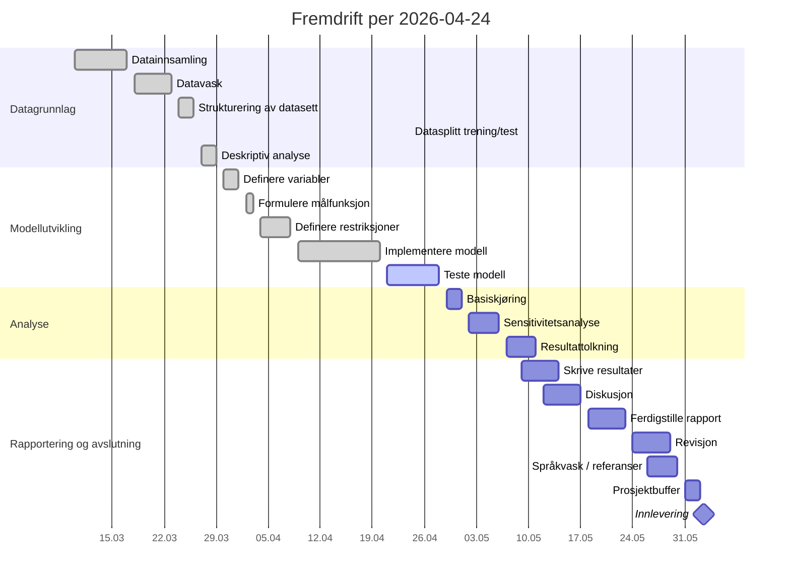

# Status - Minimering av drivstoffkostnader hos Odfjell Tankers

_Sist oppdatert automatisk: 2026-04-24_

Denne filen er generert fra:
- `012 fase 2 - plan/Prosjektstyringsplan, Odfjell Tankers.md`
- `012 fase 2 - plan/MS_Project.mpp`
- faktiske filer og siste aktivitet i repoet

## Innholdsfortegnelse

- [Statusdashboard](#statusdashboard)
- [Neste steg](#neste-steg)
- [Gantt og milepæler](#gantt-og-milepæler)
- [Aktivitetsstatus](#aktivitetsstatus)
- [Aktivitetssjekklister](#aktivitetssjekklister)
- [Spor i repoet](#spor-i-repoet)
- [Manuelle merknader](#manuelle-merknader)

## Statusdashboard

| Felt | Status |
| --- | --- |
| Fase nå | Modellutvikling |
| Aktivitet nå | `Teste modell` |
| Planperiode nå | 2026-04-21 til 2026-04-28 |
| Neste aktivitet | `Basiskjøring` |
| Neste milepæl | `Modelltesting ferdig` 2026-04-28 |
| Fullførte aktiviteter | 9 av 19 |
| Aktiviteter pågår | 1 |
| Aktiviteter kommende | 9 |
| Fremdriftsvurdering | Prosjektet ser ut til å ligge på plan, men `Teste modell` mangler fortsatt en kort testoppsummering før aktiviteten kan lukkes |

- Planunderlaget er dokumentert i både prosjektstyringsplanen og `MS_Project.mpp`.
- Repoet inneholder rådata i `004 data`, renset og strukturert datasett i `006 analysis/01_datagrunnlag`, samt modellinput og modellimplementasjon i `006 analysis/02_modellutvikling`.
- Deskriptive figurer og tabeller er nå dokumentert i `006 analysis/01_datagrunnlag/04_deskriptiv_analyse` og brukt i `005 report/rapport.md`.

[Til toppen](#innholdsfortegnelse)

## Neste steg

### Nå

- [x] Datagrunnlag er renset, strukturert og dokumentert
- [x] Modellinput for versjon 1 er etablert
- [x] Første modellimplementasjon finnes i `006 analysis/02_modellutvikling/04_implementere_modell`
- [x] Simulert modelltest er kjørt og outputfiler finnes i `006 analysis/02_modellutvikling/05_teste_modell/output`
- [ ] Skriv et kort testnotat som beskriver hva som er kjørt
- [ ] Skriv en kort vurdering av om modellen oppfører seg som forventet
- [ ] Legg inn en eksplisitt konklusjon om at modellen er klar for `Basiskjøring`

### For å lukke neste aktivitet

Neste aktivitet som naturlig kan lukkes er `Teste modell`.

For å markere `Teste modell` som fullført bør dere minst ha:
- [ ] en kort testbeskrivelse av hva som er kjørt
- [ ] en vurdering av om modellen oppfører seg konsistent med forventet logikk
- [ ] en eksplisitt henvisning til resultatfilene i `006 analysis/02_modellutvikling/05_teste_modell/output`
- [ ] en kort konklusjon om at modellen er klar for `Basiskjøring`

### Etterpå

- Når `Teste modell` er lukket, starter `Basiskjøring` i perioden 2026-04-29 til 2026-05-01.
- Etter `Basiskjøring` følger `Sensitivitetsanalyse` og deretter `Resultattolkning`.

[Til toppen](#innholdsfortegnelse)

## Gantt og milepæler

### Milepæler

Neste kommende milepæl er **Modelltesting ferdig** den **2026-04-28**.

| Milepæl | Dato | Status | Kommentar |
| --- | --- | --- | --- |
| Proposal godkjent | 2026-02-08 | Passert | Fullført tidligere i prosjektet |
| Planleggingsfase ferdig | 2026-03-09 | Passert | Fullført tidligere i prosjektet |
| Datagrunnlag ferdig | 2026-03-29 | Passert | Datagrunnlaget er dokumentert og brukt videre |
| Modelltesting ferdig | 2026-04-28 | Kommende | Kan nås hvis `Teste modell` lukkes i tide |
| Innlevering | 2026-06-02 | Kommende | Styrende sluttdato fra `MS_Project.mpp` |

### Gantt-oversikt

#### ASCII-visning

Forklaring:
- `██` = fullført
- `▓▓` = pågår
- `··` = kommende

| Fase | Aktivitet | Periode | Status | Tidslinje |
| --- | --- | --- | --- | --- |
| Datagrunnlag | Datainnsamling | 2026-03-10–2026-03-17 | Fullført | `██` |
| Datagrunnlag | Datavask | 2026-03-18–2026-03-23 | Fullført | `██` |
| Datagrunnlag | Strukturering av datasett | 2026-03-24–2026-03-26 | Fullført | `██` |
| Datagrunnlag | Datasplitt trening/test | 2026-04-24 | Fullført | `██` |
| Datagrunnlag | Deskriptiv analyse | 2026-03-27–2026-03-29 | Fullført | `██` |
| Modellutvikling | Definere variabler | 2026-03-30–2026-04-01 | Fullført | `██` |
| Modellutvikling | Formulere målfunksjon | 2026-04-02–2026-04-03 | Fullført | `██` |
| Modellutvikling | Definere restriksjoner | 2026-04-04–2026-04-08 | Fullført | `██` |
| Modellutvikling | Implementere modell | 2026-04-09–2026-04-20 | Fullført | `██` |
| Modellutvikling | Teste modell | 2026-04-21–2026-04-28 | Pågår | `▓▓` |
| Analyse | Basiskjøring | 2026-04-29–2026-05-01 | Kommende | `··` |
| Analyse | Sensitivitetsanalyse | 2026-05-02–2026-05-06 | Kommende | `··` |
| Analyse | Resultattolkning | 2026-05-07–2026-05-11 | Kommende | `··` |
| Rapportering | Skrive resultater | 2026-05-09–2026-05-14 | Kommende | `··` |
| Rapportering | Diskusjon | 2026-05-12–2026-05-17 | Kommende | `··` |
| Rapportering | Ferdigstille rapport | 2026-05-18–2026-05-23 | Kommende | `··` |
| Rapportering | Revisjon | 2026-05-24–2026-05-29 | Kommende | `··` |
| Rapportering | Språkvask / referanser | 2026-05-26–2026-05-30 | Kommende | `··` |
| Avslutning | Innlevering | 2026-06-02 | Kommende | `··` |

#### Mermaid-visning

[Til toppen](#innholdsfortegnelse)

## Aktivitetsstatus

| Fase | Aktivitet | Start | Slutt | Status 2026-04-24 | Neste handling / grunnlag |
| --- | --- | --- | --- | --- | --- |
| Datagrunnlag | Datainnsamling | 2026-03-10 | 2026-03-17 | Fullført | Dokumentert i repo |
| Datagrunnlag | Datavask | 2026-03-18 | 2026-03-23 | Fullført | Dokumentert i `006 analysis/01_datagrunnlag/02_datavask` med rensepipeline og renset fil |
| Datagrunnlag | Strukturering av datasett | 2026-03-24 | 2026-03-26 | Fullført | Dokumentert i `006 analysis/01_datagrunnlag/03_strukturering_av_datasett` med aggregert datasett og metadata |
| Datagrunnlag | Datasplitt trening/test | 2026-04-24 | 2026-04-24 | Fullført | Trenings- og testfiler er opprettet i `004 data` med 80/20-splitt sortert etter `Delivery Date` |
| Datagrunnlag | Deskriptiv analyse | 2026-03-27 | 2026-03-29 | Fullført | Dokumentert i `006 analysis/01_datagrunnlag/04_deskriptiv_analyse` med figurer, figurguide og bruk i `rapport.md` |
| Modellutvikling | Definere variabler | 2026-03-30 | 2026-04-01 | Fullført | Dokumentert i modellkapitlet i `005 report/rapport.md` og støttet av modellinput |
| Modellutvikling | Formulere målfunksjon | 2026-04-02 | 2026-04-03 | Fullført | Dokumentert i `005 report/rapport.md` og reflektert i modellskriptene |
| Modellutvikling | Definere restriksjoner | 2026-04-04 | 2026-04-08 | Fullført | Restriksjonsstruktur er dokumentert i `rapport.md` og reflektert i `run_model_v1_pyomo.py` |
| Modellutvikling | Implementere modell | 2026-04-09 | 2026-04-20 | Fullført | Modellinput, Pyomo-implementasjon og aktivitetsstruktur er etablert i `006 analysis/02_modellutvikling/04_implementere_modell` |
| Modellutvikling | Teste modell | 2026-04-21 | 2026-04-28 | Pågår | Skriv kort testoppsummering og vurdering av modellatferd før aktiviteten lukkes |
| Analyse | Basiskjøring | 2026-04-29 | 2026-05-01 | Kommende | Starter når `Teste modell` er lukket |
| Analyse | Sensitivitetsanalyse | 2026-05-02 | 2026-05-06 | Kommende | Avhenger av `Basiskjøring` |
| Analyse | Resultattolkning | 2026-05-07 | 2026-05-11 | Kommende | Avhenger av `Sensitivitetsanalyse` |
| Rapportering | Skrive resultater | 2026-05-09 | 2026-05-14 | Kommende | Starter etter første resultatgrunnlag |
| Rapportering | Diskusjon | 2026-05-12 | 2026-05-17 | Kommende | Avhenger av `Skrive resultater` |
| Rapportering | Ferdigstille rapport | 2026-05-18 | 2026-05-23 | Kommende | Avhenger av `Diskusjon` |
| Rapportering | Revisjon | 2026-05-24 | 2026-05-29 | Kommende | Avhenger av `Ferdigstille rapport` |
| Rapportering | Språkvask / referanser | 2026-05-26 | 2026-05-30 | Kommende | Avhenger av `Revisjon` |
| Avslutning | Prosjektbuffer | 2026-05-31 | 2026-06-02 | Kommende | Reservert buffer før innlevering |
| Avslutning | Innlevering | 2026-06-02 | 2026-06-02 | Kommende | Endelig milepæl |

[Til toppen](#innholdsfortegnelse)

## Aktivitetssjekklister

### Rense og strukturere data

Status: **Fullført**

#### Fullførte aktiviteter

- [x] Rådatafilen er identifisert og brukes konsekvent som kilde: `004 data/Bunker Lifting List(Worksheet1) (1).csv`
- [x] Rensepipeline er etablert i `006 analysis/01_datagrunnlag/02_datavask/src/clean_and_aggregate_bunker_data.py`
- [x] Renselogikken leser inn transaksjonsrader og filtrerer bort tomme eller ugyldige rader
- [x] Datoer og tallfelt parses eksplisitt i rensepipen
- [x] `Invoiced Qty` brukes som hovedvolum med fallback til `Ordered Qty`
- [x] `Invoice Price` brukes som hovedpris med fallback til `Order Price`
- [x] Observasjoner med manglende pris eller volum etter fallback håndteres eksplisitt i rensepipen
- [x] Observasjoner med ikke-positivt volum forkastes eksplisitt i rensepipen
- [x] Observasjoner med ikke-positiv pris forkastes eksplisitt i rensepipen
- [x] Rensede variabler som `delivery_month`, `delivery_year`, `effective_qty`, `effective_price` og `cost_value` opprettes
- [x] Renset transaksjonsfil er generert: `006 analysis/01_datagrunnlag/02_datavask/output/tab_bunker_cleaned.csv`
- [x] Aggregert datasett per `måned × havn` er generert: `006 analysis/01_datagrunnlag/03_strukturering_av_datasett/data/tab_bunker_monthly_by_port.csv`
- [x] Aggregatet inneholder sentrale strukturvariabler som transaksjonsantall, total mengde, vektet snittpris, enkelt snitt, minimum, maksimum og antall unike fartøy og leverandører
- [x] Oppsummeringsfil med nøkkeltall og renseutfall er generert: `006 analysis/01_datagrunnlag/03_strukturering_av_datasett/metadata/tab_bunker_summary.md`
- [x] Det aggregerte datasettet brukes videre som kilde til modellinput i `006 analysis/02_modellutvikling/04_implementere_modell/src/generate_model_v1_inputs.py`
- [x] Modellinput er generert videre til pris-, behovs- og tilgjengelighetsfiler i `006 analysis/02_modellutvikling/04_implementere_modell/input`

#### Kontrollpunkter som er oppfylt

- [x] Filene i aktivitetsmappene under `006 analysis/01_datagrunnlag` finnes og samsvarer med rense- og aggregeringsløpet
- [x] Kolonnenavnene i renset fil og aggregert fil er konsistente med videre bruk i modellinput
- [x] Antall observasjoner etter rensing er dokumentert i oppsummeringsfilen
- [x] Antall forkastede observasjoner er dokumentert i oppsummeringsfilen
- [x] Tidsperioden i aggregatet er dokumentert og brukt videre i modellinput
- [x] Havnene i aggregatet stemmer med havnene som brukes i modellversjon 1
- [x] Datastrukturen er tilstrekkelig moden til å støtte arbeidet med `Definere variabler`, `Formulere målfunksjon` og `Implementere modell`

#### Verifisert opprydding før lukking av aktiviteten

- [x] `006 analysis/01_datagrunnlag/03_strukturering_av_datasett/metadata/tab_bunker_summary.md` er kontrollert direkte som UTF-8 og viser korrekt norsk tekst
- [x] `006 analysis/02_modellutvikling/04_implementere_modell/README.md` er kontrollert direkte som UTF-8 og viser korrekt norsk tekst
- [x] Statusgrunnlaget i denne filen er oppdatert slik at `Datavask` og `Strukturering av datasett` står som fullført
- [x] Det er lagt inn en kort metodebeskrivelse i rapportens kapittel `5 Metode og data` som forklarer rense- og aggregeringsløpet

#### Vurdering

- [x] Datavask er gjennomført og dokumentert
- [x] Strukturering av datasett er gjennomført og dokumentert
- [x] Aktiviteten `Rense og strukturere data` kan lukkes faglig i prosjektplanen

### Teste modell

Status: **Pågår**

#### Ferdig så langt

- [x] Modellinput for versjon 1 finnes i `006 analysis/02_modellutvikling/04_implementere_modell/input`
- [x] Første Pyomo-implementasjon finnes i `006 analysis/02_modellutvikling/04_implementere_modell/src/run_model_v1_pyomo.py`
- [x] Simulert testskript finnes i `006 analysis/02_modellutvikling/05_teste_modell/src/simulate_model_v1_results.py`
- [x] Testoutput er opprettet i `006 analysis/02_modellutvikling/05_teste_modell/output`
- [x] Simulert modellsammendrag er generert i `res_model_v1_summary.json`

#### Må gjøres før aktiviteten kan lukkes

- [ ] Skriv et kort testnotat som beskriver hva som er kjørt
- [ ] Beskriv om testgrunnlaget er solver-kjøring, simulert test eller begge deler
- [ ] Vurder om modellen oppfører seg konsistent med forventet logikk
- [ ] Henvis eksplisitt til resultatfilene i `006 analysis/02_modellutvikling/05_teste_modell/output`
- [ ] Konkluder kort med om modellen er klar for `Basiskjøring`

### Datasplitt trening/test

Status: **Fullført**

#### Fullførte aktiviteter

- [x] Rådatasettet er sortert etter `Delivery Date` for å sikre kronologisk splitt
- [x] De tidligste 80 % av observasjonene er lagt i treningsfil
- [x] De siste 20 % av observasjonene er lagt i testfil
- [x] Originalfilen `004 data/Bunker Lifting List(Worksheet1) (1).csv` er beholdt uendret
- [x] Treningsfil er opprettet: `004 data/Bunker Lifting List(Worksheet1) (1)_train_80.csv`
- [x] Testfil er opprettet: `004 data/Bunker Lifting List(Worksheet1) (1)_test_20.csv`

#### Vurdering

- [x] Datasplitt trening/test er gjennomført og dokumentert
- [x] Steget kan behandles som fullført støtteaktivitet i datagrunnlaget

[Til toppen](#innholdsfortegnelse)

## Spor i repoet

- Siste datafil: `004 data/Bunker Lifting List(Worksheet1) (1).csv` sist endret 2026-03-31 15:32
- Siste analysefil: `006 analysis/01_datagrunnlag/04_deskriptiv_analyse/figures/fig_bunker_weighted_price_by_port_month.png` sist endret 2026-04-24 09:58
- Siste modellfil: `006 analysis/02_modellutvikling/05_teste_modell/output/res_model_v1_summary.json` sist endret 2026-04-24 10:16
- Siste rapportfil: `005 report/rapport.md` sist endret 2026-04-24 10:15

### Siste git-aktivitet

- `2026-04-24 da4b7ed commit	modified:   005 report/rapport.md modified:   006 analysis/01_datagrunnlag/generate_bunker_figures.py new file:   006 analysis/01_datagrunnlag/figures/fig_bunker_season_profile.png new file:   006 analysis/01_datagrunnlag/figures/fig_bunker_total_qty_by_month.png new file:   006 analysis/01_datagrunnlag/figures/fig_bunker_weighted_price_by_port_month.png`
- `2026-04-24 f49b4ff commit	modified:   005 report/rapport.md new file:   006 analysis/01_datagrunnlag/generate_bunker_figures.py new file:   006 analysis/pyproject.toml new file:   006 analysis/uv.lock`
- `2026-04-24 f1cd764 Modellering: Detaljert forklaring av lineær optimaliseringsmodell, og simulatoren for modelltesting`
- `2026-04-24 600f057 Elisabeth_rapport.md: Fyllt inn hele rapporten med innledning, metodebeskrivelse, modellering og struktur for analyse/resultat`
- `2026-04-24 c1f7056 Dokumenter modellutvikling og analysegrunnlag`

[Til toppen](#innholdsfortegnelse)

## Manuelle merknader

Tekstplanen nevner endelig innlevering **2026-05-31**, mens `MS_Project.mpp` viser **2026-06-02** inkludert prosjektbuffer. Statusen under følger datoene i `MS_Project.mpp`.

### Manuell merknad 2026-04-12

- Følgende planartefakter er opprettet i `012 fase 2 - plan`: `core.json`, `requirements.json`, `risk.json`, `schedule.json` og `wbs.json`.
- JSON-filene er strukturert fra prosjektstyringsplanen, `MS_Project.mpp` og denne statusfilen.
- WBS-strukturen er delvis avledet, fordi vedlegg B i den konverterte Markdown-filen ikke inneholder en utfylt maskinlesbar WBS.
- Det er også opprettet `README.md` som forklarer innholdet og bruken av planartefaktene.
- Datagrunnlaget i `004 data/Bunker Lifting List(Worksheet1) (1).csv` er gjennomgått som grunnlag for modellering.
- Et separat arbeidsutkast er opprettet i `005 report/Kaylee_rapport.md` med første databeskrivelse og et første modellutkast for beslutningsvariabler, målfunksjon og restriksjoner.
- Målfunksjonen for første modellversjon er nå også formulert eksplisitt i `005 report/rapport.md`.
- Det er laget en rense- og aggregeringspipeline i `006 analysis/01_datagrunnlag/02_datavask/src/clean_and_aggregate_bunker_data.py`.
- Rensede og aggregerte datafiler er opprettet i aktivitetsmappene under `006 analysis/01_datagrunnlag`, inkludert månedlig aggregat per havn.
- Modellinput for modellversjon 1 er opprettet i `006 analysis/02_modellutvikling/04_implementere_modell/input` med tydelige filnavn for pris, behov, tilgjengelighet og parameter-metadata.
- En første Pyomo-implementasjon for modellversjon 1 er opprettet i `006 analysis/02_modellutvikling/04_implementere_modell/src/run_model_v1_pyomo.py`.

### Arbeid i dag 2026-04-12

#### Ferdigstilt

- Datavask er dokumentert og gjennomført for tilgjengelig bunkringsdata.
- Strukturering av datasett er gjennomført med egne rensede og aggregerte filer.
- Beslutningsvariabler for første modellversjon er formulert i `005 report/Kaylee_rapport.md`.
- Målfunksjonen er formulert i både `005 report/Kaylee_rapport.md` og `005 report/rapport.md`.
- Modellinput for versjon 1 er etablert i `006 analysis/02_modellutvikling/04_implementere_modell/input`.

#### Under arbeid

- Restriksjonene for første modellversjon videreutvikles i `005 report/Kaylee_rapport.md`.
- Implementering av modellversjon 1 pågår i `006 analysis/02_modellutvikling`.
- Avklaring av hvilke supplerende data som trengs for en mer realistisk operativ modell pågår.

#### Anbefalt oppdatering i MS Project

- Marker som fullført: `Datavask`
- Marker som fullført: `Strukturering av datasett`
- Marker som fullført: `Definere variabler`
- Marker som fullført: `Formulere målfunksjon`
- Marker som under arbeid: `Definere restriksjoner`
- Marker som under arbeid: `Implementere modell`

### Manuell merknad 2026-04-24

- `006 analysis` er restrukturert etter hovedfaser og aktiviteter i prosjektplanen, med egne mapper for datavask, strukturering av datasett, deskriptiv analyse, modellimplementering og modelltesting.
- Deskriptiv analyse er nå eksplisitt dokumentert med figurer, figurguide og tabeller som brukes i `005 report/rapport.md`.
- Modellkapitlet i `005 report/rapport.md` er utvidet og samordnet med faktisk analysearbeid og dagens datagrunnlag.
- Modellinput for versjon 1 er regenerert i `006 analysis/02_modellutvikling/04_implementere_modell/input`.
- Simulert modelltest er gjennomført i `006 analysis/02_modellutvikling/05_teste_modell`, og resultatfiler er opprettet i `output`.
- Rådatasettet i `004 data` er splittet i en treningsfil og en testfil med 80/20-splitt etter tidligste og siste observasjoner.
- Datakvalitet er omtalt eksplisitt i `005 report/rapport.md` med en antagelse om at datasettet allerede er kvalitetssjekket av Odfjell Tankers før overlevering til prosjektgruppen.
- Internt møte mellom Elisabeth og Kaylee 24.04.2026 er dokumentert i `002 meetings/04 24.04.2026/Møtereferat 4.md`, med statusgjennomgang og plan fram mot peer-to-peer review 30.04.2026.

### Arbeid i dag 2026-04-24

#### Ferdigstilt

- Deskriptiv analyse er dokumentert med egne figurer og tabeller.
- Datasplitt trening/test er gjennomført med egne train/test-filer i `004 data`.
- `Definere variabler`, `Formulere målfunksjon` og `Definere restriksjoner` er dokumentert i rapporten og støttet av modellstrukturen.
- `Implementere modell` er gjennomført med egen aktivitetsmappe, modellinput og Pyomo-implementasjon.
- Struktur for `006 analysis` følger nå prosjektplanens aktiviteter og er ryddet opp for videre arbeid.
- Innledningen og store deler av kapittel 3, 4 og 5 er klargjort for videre samordning før peer-to-peer review.

#### Under arbeid

- `Teste modell` pågår i planperioden 2026-04-21 til 2026-04-28.
- Testarbeidet har produsert simulerte outputfiler, men mangler fortsatt en kort eksplisitt testoppsummering som beskriver hva som er kontrollert og hva som eventuelt gjenstår.
- Avklaring av hvilke supplerende data som trengs for en mer realistisk operativ modell pågår fortsatt.
- Modellen videreutvikles med tilgjengelig datagrunnlag, og rapporten skal forklare at etterspurt tilleggsdata kan gjøre modellen mer presis når dataene blir tilgjengelige.

#### Hva som må til for å markere neste del som fullført

- Neste aktivitet som naturlig kan lukkes er `Teste modell`.
- For å markere `Teste modell` som fullført bør dere minst ha:
  - en kort testbeskrivelse av hva som er kjørt
  - en vurdering av om modellen oppfører seg konsistent med forventet logikk
  - en eksplisitt henvisning til resultatfilene i `006 analysis/02_modellutvikling/05_teste_modell/output`
  - en kort konklusjon om at modellen er klar for `Basiskjøring`

#### Anbefalt oppdatering i MS Project

- Marker som fullført: `Deskriptiv analyse`
- Marker som fullført: `Definere variabler`
- Marker som fullført: `Formulere målfunksjon`
- Marker som fullført: `Definere restriksjoner`
- Marker som fullført: `Implementere modell`
- Marker som under arbeid: `Teste modell`

[Til toppen](#innholdsfortegnelse)
